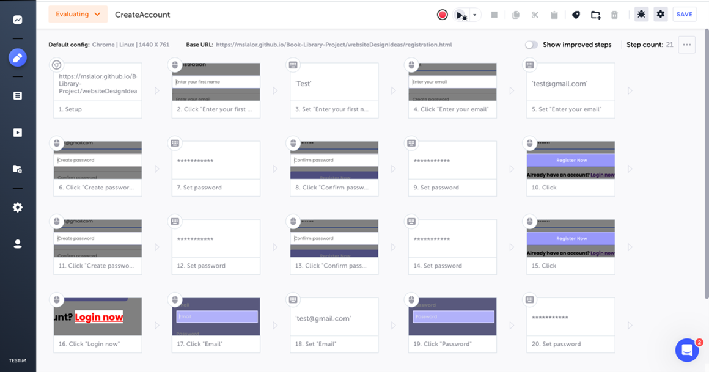
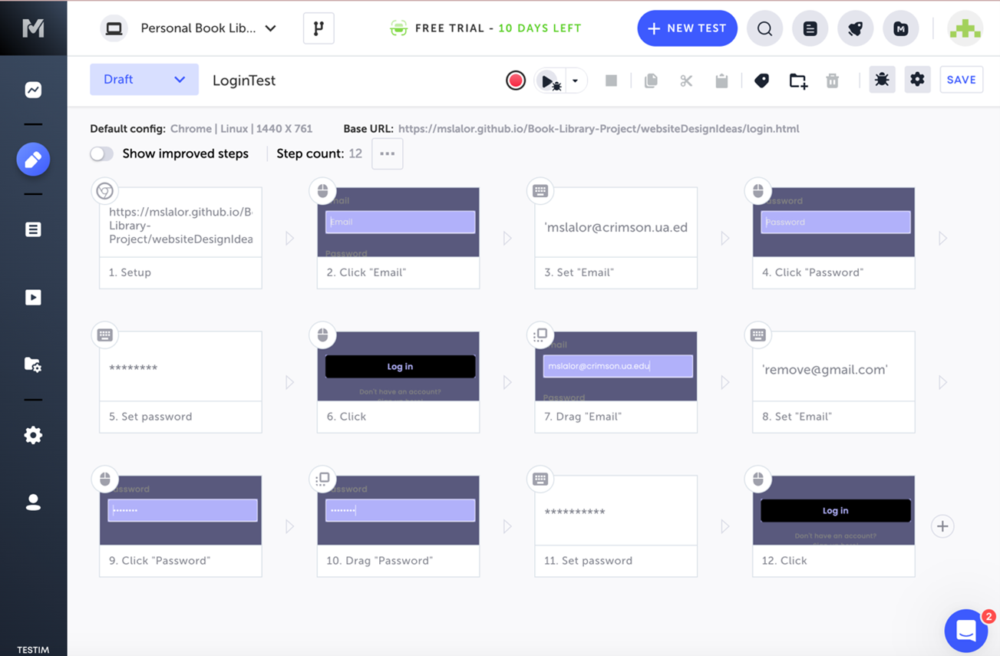
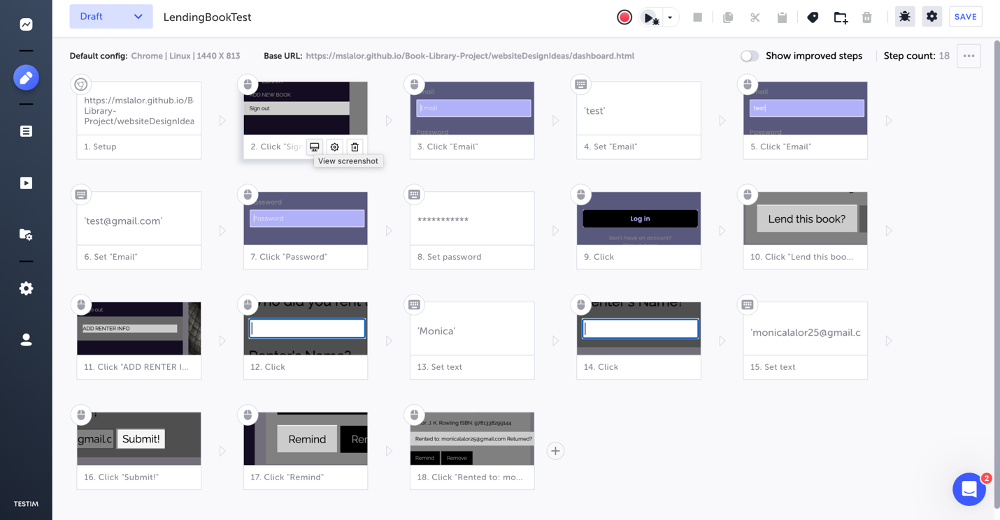
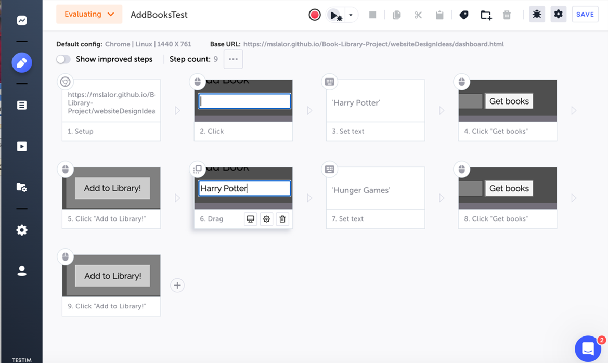
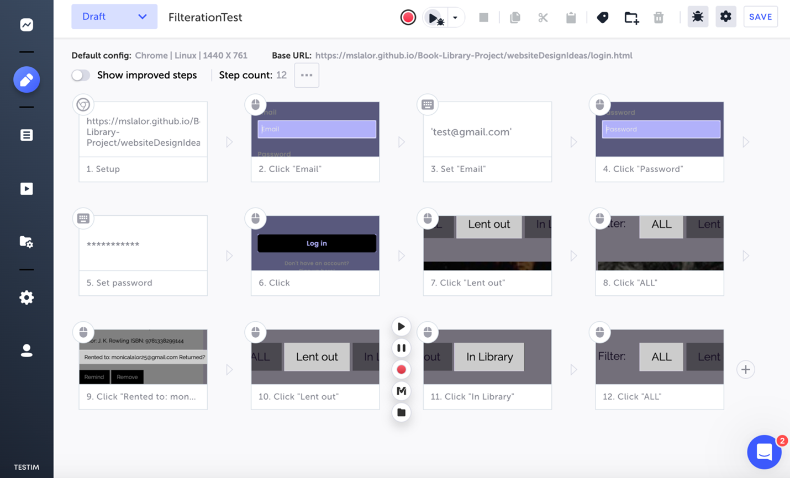
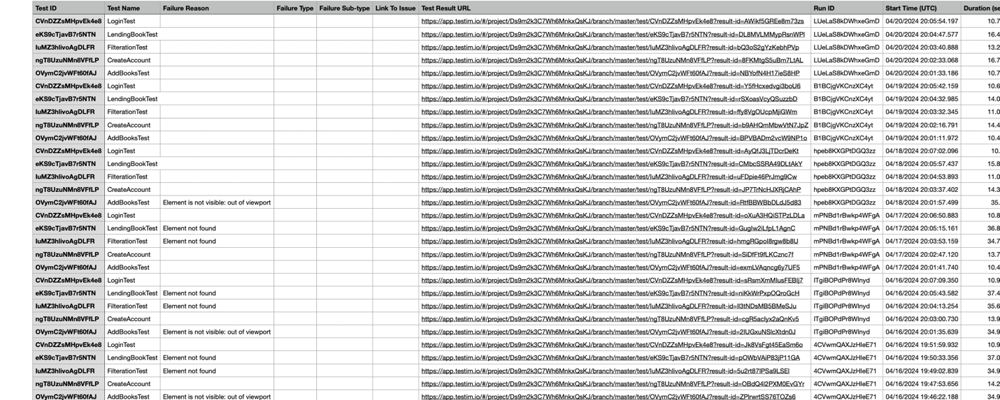
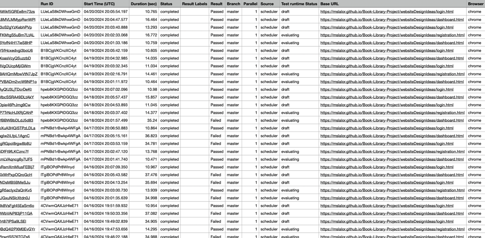

We began automated testing after we finished our informal testing. We did this using a website called Testim. This software allows us to create tests and schedule them to run daily at 3 pm. We are able to download the reports and check to see which steps failed and why. Below is a list our tests and if they were successful or not. 

- Login and Registration Test:
    * Registration
        + The test puts in a test email and name. 
        + For the password, first it tries putting in two not matching passwords and it doesn’t work. Then it fixes the password and the registration should go through. There is a success pop up and it redirects to Login Page

- Login 
    * At the login page, it puts in the newly created account and password info
    * It will succeed if the login takes your to the correct dashboard. 

- Lending Book Test 
    * First you login to the database. 
        + This should be successful as the login test always runs first. 
    * Then you go to the lend button and click it, and input the user information. 
        + First, a side bar should pop up which brings you down to the form to input the renter information. 
        + You are able to type a name and email. 
        + After you are done, you submit, and the pop up should disappear. 
        + Next, the lend button should hold the name that you put in, and the remind button should be enabled. 
        + Finally, the system will click the return button and the button should revert to the original state. 

- Add Book Test
    * First we test the search functionality. 
        + The test puts a title into the search bar and then waits for results
        + After finding the desired book,  you click add, and it adds to the library. 
        + The test will fail if any of these steps do not work.

- Filtration Test
    * The test will click on the in library button, the all books button, and the lent out button. 
        + The in library button should only show those books that are not currently lent out
        + The all books button should show every book in the order that it was added to the library. 
        + The lent books button should show only those that have been lent out. 
    * It then tests the filter after we change the status of a book. 
        + We click the return button on a rented out book
        + This also doubles as a test of the edit status function
        + Then, the steps above repeat. 

These are the tests that we have had done for the past few weeks. We still are working on our tests for remove, and remind. However below is a screenshot of the complete and successful test runs. 

